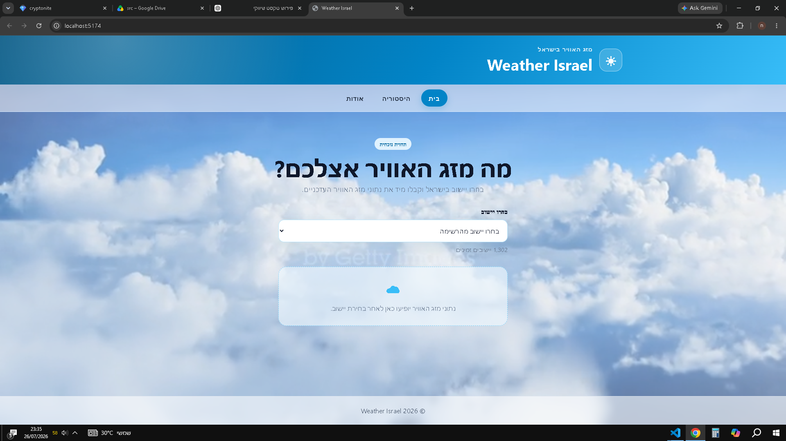

# Weather Israel

אתר להצגת מזג האוויר הנוכחי לפי בחירת יישוב בישראל. המשתמש בוחר יישוב מתוך רשימה דינמית, מקבל את נתוני מזג האוויר העדכניים ויכול לצפות בהיסטוריית החיפושים שביצע.

## צילום מסך

## תכונות מרכזיות

- טעינה דינמית של יישובים ממאגר המידע הממשלתי.
- הצגת שם היישוב בעברית ושימוש בשם האנגלי לצורך החיפוש.
- הצגת מדינה, עיר, טמפרטורה, תיאור מזג האוויר, מהירות רוח וסמל מתאים.
- ביצוע החיפוש מיד לאחר בחירת יישוב, ללא כפתור נוסף.
- שמירת היסטוריית החיפושים בדפדפן.
- ניווט בין דף הבית, דף ההיסטוריה ודף האודות.
- טיפול במצבי טעינה ובשגיאות.
- עיצוב רספונסיבי המתאים למחשב ולטלפון.
- רקע וידאו נע של עננים.

## טכנולוגיות וספריות

- React
- TypeScript
- Vite
- Axios
- React Router
- iziToast
- error-extractor
- CSS

## שירותי מידע

רשימת היישובים מתקבלת ממאגרי המידע הממשלתיים:

~~~text
https://data.gov.il/api/3/action/datastore_search
~~~

נתוני מזג האוויר מתקבלים משירות WeatherAPI:

~~~text
https://api.weatherapi.com/v1/current.json
~~~

## מבנה הפרויקט

~~~text
src/
├── assets/
├── components/
│   ├── layout-area/
│   ├── page-area/
│   └── weather-area/
├── models/
├── routing/
├── services/
├── utils/
├── index.css
└── main.tsx
~~~

- assets מכילה את קובץ הווידאו של הרקע.
- components מכילה את רכיבי התצוגה והדפים.
- models מגדירה את מבנה הנתונים.
- routing מנהלת את נתיבי האתר.
- services מטפלת בבקשות ובשמירת ההיסטוריה.
- utils מכילה הגדרות וכלי עזר משותפים.

## התקנה

לאחר הורדת הפרויקט יש לפתוח מסוף בתיקייה הראשית ולהריץ:

~~~bash
npm install
~~~

## הגדרת מפתח מזג האוויר

יש ליצור בתיקייה הראשית קובץ בשם .env ולהוסיף מפתח אישי של WeatherAPI:

~~~env
VITE_WEATHER_API_KEY=your_api_key_here
~~~

## הפעלת הפרויקט

~~~bash
npm start
~~~

האתר ייפתח בכתובת המקומית שמופיעה במסוף.

## פקודות נוספות

בדיקת איכות הקוד:

~~~bash
npm run lint
~~~

יצירת גרסת הפצה:

~~~bash
npm run build
~~~

הצגת גרסת ההפצה המקומית:

~~~bash
npm run preview
~~~

## שמירת היסטוריה

היסטוריית החיפושים נשמרת באחסון המקומי של הדפדפן. כל רשומה כוללת תאריך ושעה, שם יישוב ושם מדינה. ניתן למחוק את ההיסטוריה דרך דף ההיסטוריה.

## מתכנת

חן ויצמן — מתכנת מתחיל במסגרת לימודי פיתוח תוכנה מקצה לקצה.
